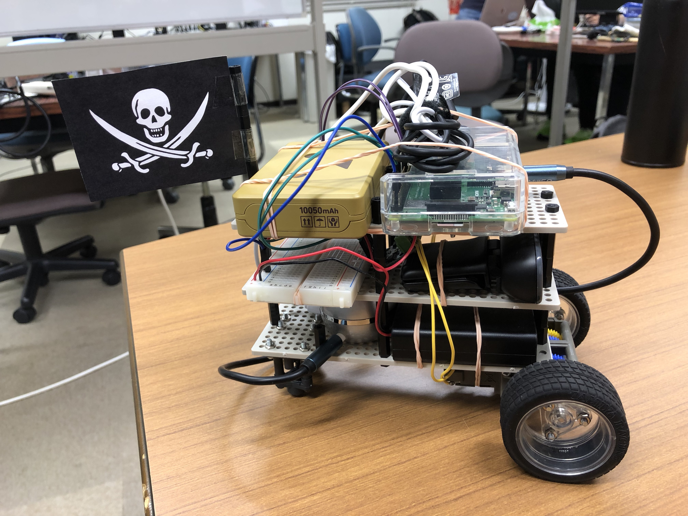

# Raspberry Pi Car

## About

They are programs that can control Raspberry Pi Car on remote.
They need a Raspberry Pi Car(for a server), a client computer installed python, gamepad controller supporting XInput.

## What can do?

They can:
- watch the video stream of the webcam
- play sound mixed with a music file and your voice
- control motors by gamepad controller

Everything above is remote and real-time.

## Image

